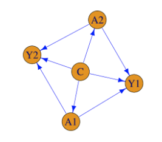

# Casual Project Spring 2024

We want to explore the effect of certain group demographic factors and health living practices on the prevalence of mental health issues among aging populations. The demographic factors of “race/ethnicity”, “gender”, “age”, and “location” will be investigated and controlled for in addition to health living practices of “eating 3 or more vegetables daily” and “getting sufficient sleep (>6 hours)”. These factors will be explored to determine their causal effect on mental health described by these downstream outcomes “lifetime diagnosis of depression” and “experiencing frequent mental distress”. We are interested in whether there exists causal effects from inherent background characteristics to identify specific populations that are more susceptible to negative outcomes like mental health issues. Elucidating these trends would allow early identification for at-risk populations for mental health issues that could improve future treatments. We also picked some additional interesting outcomes about diet and sleep schedule to explore other health trends that may cause mental health issues.

### Files
- eda.ipynb: Jupyter notebook to perform exploratory data analysis and data pre-processing on input dataset to convert into format for causal analysis. Reads input data into pandas dataframe to perform analysis.
- backdoor.py: Python script to calculate initial causal estimate using backdoor estimator method without confounders. Used as an initial set of results for project update assignment.
- backdoor_with_confounders.py: Python script to calculate final causal estimate using backdoor estimator method while taking into account confounders. 
- generate_synthetic.py: Python script to generate synthetic dataset to test whether causal estimate calculation is accurate with a known causal effect. 

### Steps to generate causal estimate
If "df_treatments_outcomes.csv" does not exist:
1. Install packages in "requirements.txt"
2. Run script "backdoor_with_confounders.py" to generate causal estimates

If "df_treatments_outcomes.csv" does not exist:
1. Download dataset "Alzheimer_s_Disease_and_Healthy_Aging_Data_20240418.csv" into "datasets" directory
2. Run notebook "eda.ipynb" to generate formatted dataframe "df_treatments_outcomes.csv"
3. Run script "backdoor_with_confounders.py" to generate causal estimates

### Packages
- statsmodels: used for built-in models to fit to data to get expected value
- sklearn: used for built-in models to fit to data to get expected value
- numpy: used for general array calculation and manipulation
- pandas: used for EDA, data pre-processing, and formatting
- scipy: used the "truncnorm" method to generate data for continuous variables for synthetic datasete
- random: used the "sample" method to generate data for categorical variables for synthetic dataset
- statistics: used for the "mean" function